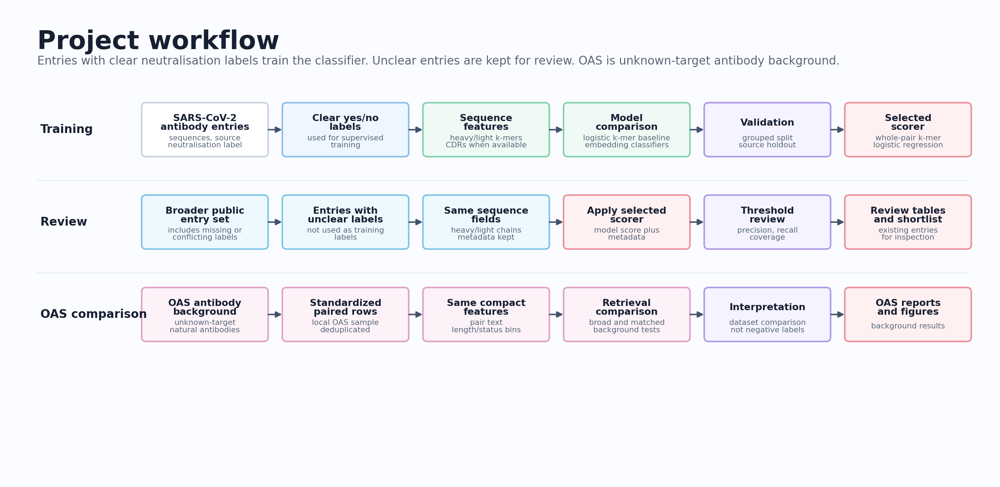

# Antibody Prioritization

This project builds an antibody sequence ML pipeline using public SARS-CoV-2 antibody records. I curated labeled public records, trained ML models to learn patterns associated with neutralising versus non-neutralising sequences, and then used the trained scoring workflow to prioritize existing OAS antibody records that look most similar to known neutralizing antibodies. The goal is finding existing records that may be worth closer expert review.

The workflow is supported by several validation, benchmarking, and robustness checks: strict versus broader label curation, grouped validation to reduce sequence-family leakage, source/study holdout validation to test cross-study generalization, calibration and threshold analysis, CDR/region feature comparisons, pretrained antibody-representation benchmarks, OAS broad and matched-background retrieval controls, nearest-neighbor similarity audits, and diversity-aware shortlist selection.

Most rows represent one public antibody entry, usually with a heavy-chain or VHH amino-acid sequence, sometimes a light-chain sequence, source information, target-region information, and, when available, a neutralising or non-neutralising label.

## Table of Contents

- [At a Glance](#at-a-glance)
- [Project Workflow](#project-workflow)
- [Main Results](#main-results)
- [Selected Model](#selected-model)
- [How To Read This](#how-to-read-this)
- [Figures](#figures)
- [Scope and Limits](#scope-and-limits)
- [Reproduce](#reproduce)
- [Useful Files](#useful-files)

## At a Glance

<p align="center">
  
</p>

| Part | What it does |
|---|---|
| Data curation | Cleans public SARS-CoV-2 antibody entries and separates clear yes/no labels from missing or conflicting labels. |
| Main classifier | Represents heavy/light-chain sequence text with k-mer TF-IDF features and trains balanced logistic regression. |
| Model comparison | Compares the k-mer baseline with pretrained antibody embedding and language-model runs. |
| CDR and region checks | Tests CDR/region sequence views on the paired annotated subset. |
| Robustness checks | Uses grouped validation, source/study holdout, calibration, and threshold analysis to test where the signal is stable. |
| OAS background controls | Compares project records against OAS unknown-target antibody background in broad and matched retrieval tasks. |
| OAS record review | Scores existing OAS records by retrieval score and similarity to curated project-positive records. |
| Shortlist selection | Builds small review queues with diversity filters rather than returning one long ranked list. |


## Project Workflow

The first layer is curation. Public CoV-AbDab rows are filtered to entries whose `Binds to` field mentions SARS-CoV-2. Sequence fields are normalized, common placeholders are treated as missing, canonical amino-acid checks are applied, and a sequence key is built from the heavy/VHH chain plus the light chain when present.

Neutralisation labels are extracted from the public record fields. A row is treated as label 1 when `Neutralising Vs` mentions SARS-CoV-2. A row is treated as label 0 when `Not Neutralising Vs` mentions SARS-CoV-2 and the positive field does not. Rows where both fields point to SARS-CoV-2 are marked as conflicts.

The strict labeled table is the supervised ML table. It keeps rows with usable binary labels and supports the main benchmarks, source/study validation, calibration checks, model selection, and sequence-space summaries. The broader prepared table keeps more public records, including rows with missing or conflicting labels, so the trained workflow can score and organize existing records for review.

| Table | Rows | Used for |
|---|---:|---|
| Strict labeled ML table | 5,573; label 0 = 2,292, label 1 = 3,281 | Supervised benchmarking, source/study holdout, calibration, model selection, and sequence-space summaries. |
| Broader prepared table | 11,748 | Existing-record scoring, missing/conflicting-label review categories, and shortlist construction. |
| Paired annotated subset | 5,092 | CDR and region feature checks on rows with paired-chain annotation. |

For modeling, antibody entries are converted into several sequence-text views: whole-pair, heavy-only, paired-only whole-pair, CDR/region, and whole-pair plus CDR/region. These views are not all available for the same rows, so full strict-table metrics and paired/region-subset metrics are reported separately.

The main baseline is intentionally simple. In this project, k-mer TF-IDF logistic regression means splitting antibody sequence text into overlapping amino-acid character k-mers, weighting those k-mers with TF-IDF, and fitting a balanced logistic-regression classifier to the public binary labels.

The OAS analyses are separate from the main neutralisation benchmark. Broad and matched OAS retrieval compare project rows against OAS unknown-target antibody background. The existing-OAS review module then ranks OAS records by a computational prioritization score built from retrieval-model score, nearest-neighbor similarity to project-positive records, top-neighbor similarity, and centroid similarity.

The shortlist step is deliberately conservative. It keeps existing records for expert review, uses hashed/public-safe outputs, applies review flags, and uses diversity filtering so the final list is not just many near-duplicates of the same sequence neighborhood.

## Main Results

| Area | Result | What it means |
|---|---:|---|
| Broad whole-pair k-mer benchmark | ROC-AUC 0.7800, PR-AUC 0.8233 | The sequence baseline learns signal on the strict labeled table. |
| Paired/region benchmark | ROC-AUC 0.6629, PR-AUC 0.6330 | CDR/region features are evaluated on the paired annotated subset, not the full strict table. |
| Source-robust selected model | `whole_pair_kmer` | The selected model under source-robust model selection. |
| Source/study holdout | weighted ROC-AUC 0.6095, weighted PR-AUC 0.6363 | Performance is lower when whole sources are held out. |
| Threshold 0.7 | precision 0.8266, recall 0.3062, coverage 0.3051 | A more selective cutoff for existing-record review. |
| Broad OAS retrieval | ROC-AUC 0.9921, PR-AUC 0.9897 | Project records are separable from OAS unknown-target antibody background. |
| Matched OAS retrieval | ROC-AUC 0.9911, PR-AUC 0.9893 | Separation stays high after coarse length and light-chain matching. |
| Diversity-aware project shortlist | 23 records | A small review queue from the broader project table. |
| OAS existing-record shortlist | 17,882 OAS rows scored; top 25 diverse records | A public-safe review queue of existing OAS records, not a binder or therapeutic claim. |

<p align="center">
  
  
</p>

## Selected Model

The selected source-robust model is `whole_pair_kmer`. It uses compact heavy/light sequence-pair text, character k-mer TF-IDF features, and balanced logistic regression.

In model-card terms, the k-mer setup is `TfidfVectorizer(analyzer="char", ngram_range=(3,5), min_df=2)` plus `LogisticRegression(max_iter=5000, class_weight="balanced")`. The workflow uses compact sequence strings for these k-mer inputs.

This model was kept as the broad scorer because it works on the full strict labeled table, has the best matched broad k-mer result, remains the selected source-robust model, and is simpler than the pretrained alternatives. Pretrained antibody representation runs are kept as benchmark evidence, but none reliably replaces the matched k-mer references on both primary metrics.

Its scores are used for ranking and review of existing records, not as biological proof.

## How To Read This

The broad whole-pair k-mer benchmark is the main strict-table classification result. It asks whether amino-acid sequence fields carry useful signal on rows with clear yes/no labels.

The paired/region benchmark answers a narrower question. It uses rows where paired-chain CDR/region annotation is available, so it should not be compared directly against full strict-table metrics.

The source/study holdout result is the skeptical check. It tests whether the model still performs when whole source groups are held out. The lower value matters because public antibody records carry study-specific structure.

The threshold analysis turns model scores into possible review cutoffs. At threshold 0.7, the model covers about 30.5% of evaluated rows with higher precision and lower recall.

The OAS tasks should be read as background and review workflows. OAS rows are unknown-target natural antibody background, not assayed negative neutralisation data. Similarity to curated project-positive records can help organize records for review, but it does not establish binding, neutralisation, or therapeutic value.

## Figures

The left plot, `threshold_precision_recall.png`, shows how precision and recall change as the review threshold moves. Higher thresholds select fewer rows; in this project, threshold 0.7 is reported as a selective review cutoff.

The right plot, `oas_matched_retrieval_score_distribution.png`, shows the matched OAS retrieval score distribution. It compares project records with OAS unknown-target antibody background after coarse matching by heavy-chain length, light-chain length, total length, and light-chain status. The strong separation is a background-retrieval diagnostic, not a neutralisation benchmark.

## Scope and Limits

This is a retrospective public-record ML project. It does not perform antibody design, sequence generation, sequence optimization, or prospective wet-lab validation.

Model scores are ranking signals for existing-record review. They are not calibrated biological truth and do not establish neutralisation, binding, developability, or therapeutic value.

OAS is used as unknown-target antibody background. It is not used as non-neutralising neutralisation data.

The OAS existing-record shortlist is an expert-review queue. It is not antibody design, therapeutic discovery, or prospective validation.

## Reproduce

The repository includes generated reports and machine-readable metrics. Some raw and processed sequence tables are local artifacts and may not be committed.

Lightweight report refresh plus tests:

```bash
python -m pip install -r requirements.txt
make reproduce-small
make test
```

Direct script:

```bash
RUN_TESTS=0 bash scripts/reproduce_final_reports.sh
```

`make report` runs the same report script with tests enabled. OAS retrieval steps are skipped if local standardized OAS data is missing. Optional pretrained model scripts use `requirements-lm.txt`.

## Useful Files

- `reports/final_project_report.md`
- `reports/model_registry.md`
- `reports/oas_existing_record_shortlist_report.md`
- `docs/DATA_CARD.md`
- `docs/MODEL_CARD.md`
- `scripts/reproduce_final_reports.sh`
- `Makefile`

Machine-readable summaries are under `reports/metrics/`.
