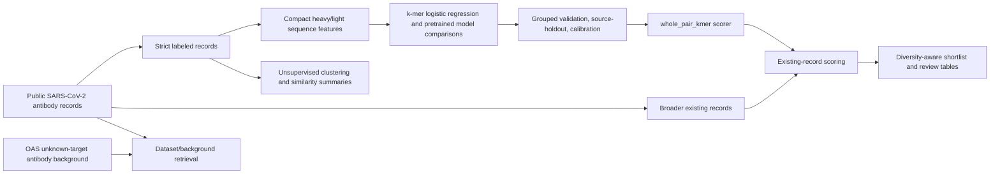

# Antibody Prioritization

This project works with public SARS-CoV-2 antibody sequence records. The data is useful, but it is also uneven: labels come from different studies, assays vary, and some records have missing or conflicting metadata.

The workflow builds a strict labeled dataset for neutralisation classification, keeps a broader table of existing records for review, and checks how much the results change under different validation splits.

The main model uses compact heavy/light sequence text, character k-mer TF-IDF features, and balanced logistic regression. I also tested pretrained antibody embedding and language-model approaches. On this dataset, the k-mer baseline performed best.

## Workflow



## Current Results

| Area | Setup | Result | Takeaway |
|---|---|---:|---|
| Broad k-mer | Full strict labeled set, V-gene grouped split, zero overlap | ROC-AUC 0.7800, PR-AUC 0.8233 | Main baseline. |
| Paired region model | Paired annotated set, V-gene grouped split, zero overlap | ROC-AUC 0.6629, PR-AUC 0.6330 | Region features helped in this subset. |
| Source-holdout | Sanitized source groups | weighted ROC-AUC 0.6095, weighted PR-AUC 0.6363 | Source/study effects remain visible. |
| Threshold 0.7 | Source-robust selected model | precision 0.8266, recall 0.3062, coverage 0.3051 | More selective review cutoff. |
| OAS retrieval | Project records vs OAS unknown-target antibody background | ROC-AUC 0.9921, PR-AUC 0.9897 | Dataset/background comparison. |
| Matched OAS retrieval | Coarse length/status matched OAS background | ROC-AUC 0.9911, PR-AUC 0.9893 | Separation stayed high after matching. |
| Diversity-aware shortlist | Broader prioritization table | 23 records | Small review table. |

## Reading The Results

The grouped k-mer benchmark is the main broad classification result in the project. The source-holdout result is lower, which points to study effects, assay differences, and label noise in the task.

The selected broad model is `whole_pair_kmer`: compact heavy/light sequence-pair text represented with character k-mer TF-IDF and a balanced logistic-regression classifier. Its probabilities are used as ranking and review scores for existing records. At threshold 0.7, the model becomes more selective and covers about 31% of records in the evaluated split.

The OAS retrieval analysis compares project records with OAS unknown-target antibody background. It is useful for understanding dataset separation, and the signal remains high after coarse matching on length and light-chain status.

## Reproducing The Reports

The repository includes generated reports and machine-readable metrics. Raw and processed sequence tables are local artifacts kept outside the public repository.

```bash
python -m pip install -r requirements.txt
make report
make test
```

Equivalent direct command:

```bash
bash scripts/reproduce_final_reports.sh
```

Optional pretrained model scripts use the packages listed in `requirements-lm.txt`. The saved reports can be read without rerunning those heavier experiments.

## Repository Layout

```text
data/          # Placeholder for local data; raw and processed sequence tables stay local
docs/          # Data and model cards
models/        # Small saved classical model artifacts
reports/       # Generated reports, metrics, and figures
scripts/       # Reproduction helpers
src/           # Data, model, and analysis code
tests/         # Lightweight integrity checks
```

## Useful Files

- `reports/final_project_report.md`
- `reports/model_registry.md`
- `reports/source_robust_model_selection_report.md`
- `reports/calibration_threshold_report.md`
- `reports/oas_background_retrieval_report.md`
- `reports/oas_matched_background_retrieval_report.md`
- `reports/unsupervised_antibody_landscape_report.md`
- `docs/DATA_CARD.md`
- `docs/MODEL_CARD.md`

Machine-readable summaries are under `reports/metrics/`.
