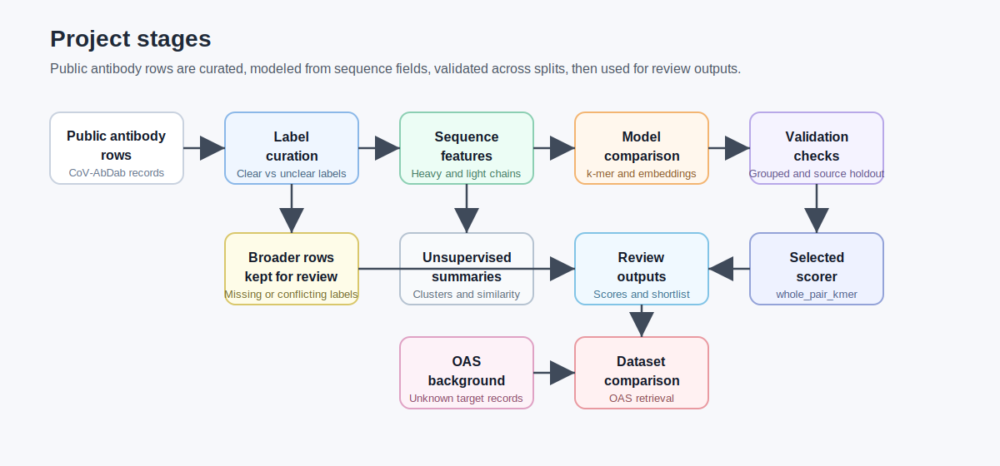
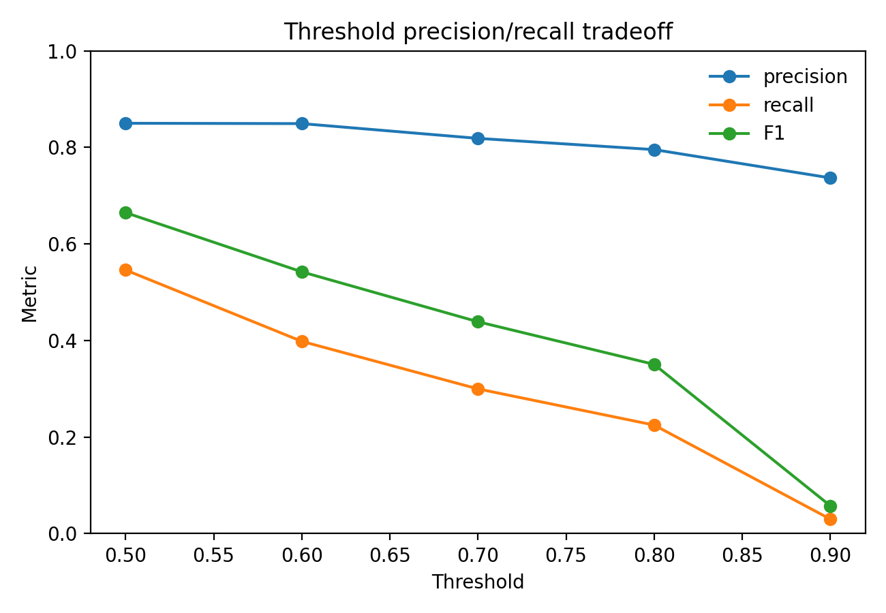
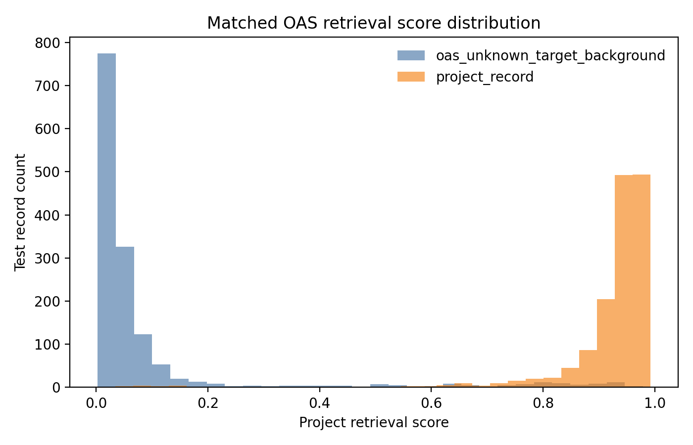

# Antibody Prioritization

This repository analyzes public SARS-CoV-2 antibody sequence data. Each row is one antibody entry, usually with heavy-chain and light-chain amino-acid sequences, source metadata, and sometimes a neutralising or non-neutralising label.

The project asks whether classifiers that use only amino-acid sequence fields can learn useful signal from rows with a clear neutralisation label, how stable that signal is across studies, and how the resulting scores can help review existing antibody entries.

## Project Summary

| Part | What it does |
|---|---|
| Data curation | Separates rows with clean neutralisation labels from rows with missing or conflicting labels. |
| Main classifier | Converts heavy/light-chain sequences into k-mer TF-IDF features and trains logistic regression. |
| Model comparison | Checks the k-mer baseline against pretrained antibody embedding and language-model runs. |
| Validation | Reports grouped validation, source or study holdout, calibration, and threshold behavior. |
| Existing-row review | Scores broader public records and builds a small diversity-aware shortlist. |
| OAS comparison | Uses OAS as unknown-target antibody background for dataset comparison. |
| Unsupervised analysis | Summarizes clustering and similarity patterns from sequence features. |

<p align="center">
  
</p>

## Main Results

| Area | Result | What it means |
|---|---:|---|
| Broad k-mer, grouped split | ROC-AUC 0.7800, PR-AUC 0.8233 | The sequence baseline learns signal on rows with clear labels. |
| Paired region model | ROC-AUC 0.6629, PR-AUC 0.6330 | Region features helped inside the paired annotated subset. |
| Source or study holdout | weighted ROC-AUC 0.6095, weighted PR-AUC 0.6363 | Performance is lower when whole sources are held out. |
| Threshold 0.7 | precision 0.8266, recall 0.3062, coverage 0.3051 | More selective cutoff for review of existing rows. |
| OAS retrieval | ROC-AUC 0.9921, PR-AUC 0.9897 | SARS-CoV-2 antibody rows are separable from OAS background. |
| Matched OAS retrieval | ROC-AUC 0.9911, PR-AUC 0.9893 | Separation stayed high after coarse length and light-chain matching. |
| Diversity-aware shortlist | 23 rows | Small review table from the broader row set. |

<p align="center">
  
  
</p>

## Selected Model

The selected classifier is `whole_pair_kmer`. It uses compact heavy/light sequence-pair text, character k-mer TF-IDF features, and balanced logistic regression.

This model performed better than the pretrained antibody representation runs in these reports. Its scores are used for ranking and review of existing antibody rows.

## Interpretation

The grouped validation result is the main classification benchmark. The lower source-holdout result is important because it shows that source and study structure affect the task.

The threshold analysis shows the tradeoff between precision, recall, and coverage. At threshold 0.7, the model reviews about 31% of rows in the evaluated split with higher precision and lower recall.

The OAS analysis compares SARS-CoV-2 antibody rows with unknown-target antibody background rows. It is a dataset comparison that helps show how different the project records are from broad natural antibody background.

## Reproduce

The repository includes generated reports and machine-readable metrics. Raw and processed sequence tables stay local.

```bash
python -m pip install -r requirements.txt
make report
make test
```

Direct script:

```bash
bash scripts/reproduce_final_reports.sh
```

Optional pretrained model scripts use `requirements-lm.txt`.

## Useful Files

- `reports/final_project_report.md`
- `reports/model_registry.md`
- `reports/source_robust_model_selection_report.md`
- `reports/calibration_threshold_report.md`
- `reports/oas_background_retrieval_report.md`
- `reports/oas_matched_background_retrieval_report.md`
- `reports/unsupervised_antibody_landscape_report.md`
- `docs/DATA_CARD.md`
- `docs/MODEL_CARD.md`

Machine-readable summaries are under `reports/metrics/`.
