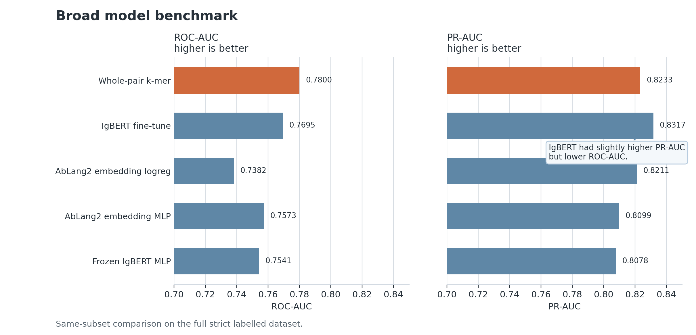
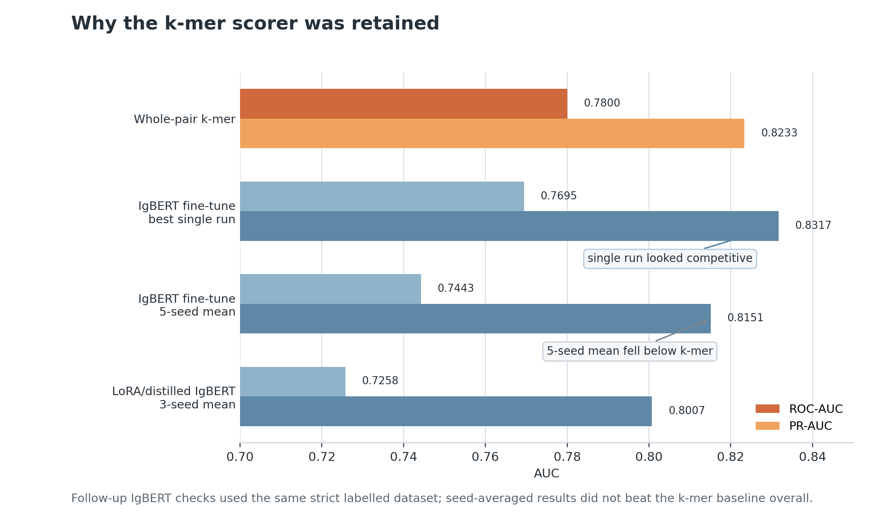

# Antibody Prioritization

This project builds an antibody sequence ML pipeline using public SARS-CoV-2 antibody records. I curated labeled public records, trained ML models to learn patterns associated with neutralising versus non-neutralising sequences, and then used the trained model scoring workflow to prioritize existing OAS antibody records that look most similar to known neutralizing antibodies. The goal is finding existing records that may be worth closer expert review.

## Table of Contents

- [Project Workflow](#project-workflow)
- [Model Benchmarking and Selection](#model-benchmarking-and-selection)
- [Main Results](#main-results)
  - [OAS Background Controls](#oas-background-controls)
- [Scope and Limits](#scope-and-limits)
- [Reproduce](#reproduce)
- [Useful Files](#useful-files)


## Project Workflow

<p align="center">
  
</p>

The project starts with CoV AbDab SARS CoV 2 entries: heavy/VHH single-domain antibody and light chain sequences are cleaned, missing values are standardised into one consistant format, amino acid strings are checked, and each record is linked to its source and target region metadata, such as antigen or epitope region, when available.

Neutralisation labels are taken directly from the public record fields. Records reported as neutralising against SARS CoV 2 form the positive class, records reported as not neutralising form the negative class, and conflicting records are kept separate rather than forced into the supervised benchmark.

After curation, the data is organised into model-ready datasets. The clearly labelled dataset is used for model benchmarking, grouped validation, source holdout, calibration, and model selection. The broader dataset that including rows with missing values or conflicting labels is kept so that its sequences so  can still be scored and reviewed as unlabelled canditates.A subset with paired heavy/light chains and marked CDR1, CDR2, and CDR3 sequence positions is used separately to compare sequences using only those marked CDR segments.

| Dataset | Rows | Used for |
|---|---:|---|
| Strict labelled ML table | 5,573; label 0 = 2,292, label 1 = 3,281 | Labelled dataset model benchmarking, source/study holdout, score/probability calibration, model selection |
| Broader prepared table | 11,748 | Existing record scoring, reviewing records with missing/conflicting labels, building the final candidate shortlist |
| Heavy/light-chain subset with marked CDR positions | 5,092 | heavy/light-chain subset with marked CDR positions |

For model training and evaluation, each antibody record is represented as heavy/VHH sequence, paired heavy-light sequence when available, CDR/region sequence, or combined full heavy-light sequence plus marked CDR segments. These representations are evaluated separately because not all records contain the same heavy, light, or VHH sequence columns.

The main reference model uses TF IDF features built from short amino acid sequence fragments and trains a class weighted logistic regression classifier. AbLang2 and IgBERT embeddings are tested separately as comparison models, not treated as automatically better.

The OAS analysis is kept separate from the model evaluation on labelled CoV-AbDab neutralisation records. OAS records with paired heavy and light chains are treated as a comparison set of natural antibody sequences with unknown targets, not as labelled SARS-CoV-2 antibodies. Existing OAS records are ranked with a composite prioritization score that combines the OAS comparison-model score with sequence similarity to curated positive CoV-AbDab records. A diversity filter is then used to build a shortlist for expert review. These records are review candidates only, not validated binders, therapeutics, or newly generated sequences.

## Model Benchmarking and Selection

The main model comparison uses the high confidence labelled CoV AbDab table. The first model benchmarked is a simple whole pair k-mer model: TF IDF features built from short amino acid sequence fragments, followed by logistic regression. I then compare this model with pretrained antibody language model approaches, including AbLang2 embeddings and IgBERT fine tuning.

The initial benchmark on the labelled dataset showed that the whole-pair k-mer model and IgBERT fine tuning were close. The k-mer model reached ROC AUC 0.7800 and PR AUC 0.8233, while the best single IgBERT fine tuning run reached ROC AUC 0.7695 and PR AUC 0.8317. IgBERT improved PR AUC slightly, but did not improve ROC AUC.
<p align="center">
  
</p>

The benchmark using the same records and split showed that IgBERT was not a clear winner over the whole-pair k-mer model: it slightly improved PR AUC, but not ROC AUC.

Because this was not a clear improvement, I did not select IgBERT based on its best single fine tuning result. A repeated IgBERT check on 5 different seeds gave lower mean performance, with ROC AUC 0.7443 and PR AUC 0.8151. Other IgBERT configurations also did not consistently outperform the k-mer baseline.

<p align="center">
  
</p>


After selecting the whole-pair k-mer model, I tested it with stricter validation checks. Grouped validation reduces leakage by making sure that closely related antibody sequences are not split between training and test data. Source and study holdout is stricter: it holds out whole publications or data sources to test whether the model still works on records from sources it did not see during training. Performance dropped under this harder test, with weighted ROC AUC 0.6095 and weighted PR AUC 0.6363.

After model selection, I checked how the model scores behave when different minimum score thresholds are used. Using 0.7 as the threshold means that only records with a model score of 0.7 or higher are selected. This produced a smaller but higher precision set of records, making it useful for expert review. 

<p align="center">
  
</p>

## Main Results

| Area | Result | Interpretation |
|---|---:|---|
| High-confidence labelled CoV-AbDab table | 5,573 records; 2,292 non-neutralising and 3,281 neutralising | Main table used for model comparison and validation. |
| Selected main model | Whole-pair k-mer TF IDF logistic regression | Selected because it was simple, reproducible, and not consistently beaten by AbLang2 or IgBERT checks. |
| Grouped validation | ROC AUC 0.7800, PR AUC 0.8233 | The selected model separates many reported neutralising and non-neutralising records when related sequence groups are kept out of both train and test overlap. |
| Repeated IgBERT check | Mean ROC AUC 0.7443, mean PR AUC 0.8151 | Repeated IgBERT fine tuning did not consistently outperform the k-mer model. |
| Source/study holdout | Weighted ROC AUC 0.6095, weighted PR AUC 0.6363 | Performance drops when whole publications or data sources are held out, so scores are used for prioritization rather than final labels. |
| Score threshold 0.7 | Precision 0.8266, recall 0.3062, coverage 0.3051 | Practical filter for smaller, higher-precision expert review lists. |
| Broader CoV-AbDab shortlist | 23 records | Review list built from broader CoV-AbDab records with missing or conflicting labels. |
| OAS existing-record shortlist | 17,882 OAS rows scored; top 25 diverse records | Existing unknown-target OAS records ranked using a composite prioritization score and similarity to curated positive CoV-AbDab records. |

### OAS Comparison and Review Shortlist

The OAS analysis is separate from the labelled CoV-AbDab neutralisation task. OAS records are used as existing natural antibody sequences with unknown targets, not as labelled SARS-CoV-2 antibodies.

First, two OAS comparison checks are run. The broad check compares curated CoV-AbDab records with the available OAS paired records. The matched check repeats the comparison after making the two sets more similar in basic structure: heavy-chain length, light-chain length, total sequence length, and whether a light chain is available.

| OAS comparison check | Result | Interpretation |
|---|---:|---|
| Broad OAS comparison | ROC AUC 0.9921, PR AUC 0.9897 | CoV-AbDab records are highly separable from the wider OAS set. |
| Matched OAS comparison | ROC AUC 0.9911, PR AUC 0.9893 | Separability remains high even after basic length and chain-availability matching. |

These comparison checks are not neutralisation benchmarks. They show how different the curated CoV-AbDab records are from OAS natural antibody records.

The OAS shortlist is then built separately from the CoV-AbDab shortlist. Existing OAS records are ranked with a combined prioritization score based on two signals: how much they look like curated CoV-AbDab records in the OAS comparison model, and how similar their sequences are to curated positive CoV-AbDab records. A diversity filter then selects the top 25 non-redundant OAS records for expert review. These records are review candidates only, not validated binders, therapeutics, or newly generated sequences.

## Reproduce

The repository includes generated reports and machine-readable metrics. Some raw and processed sequence tables are local artifacts and may not be committed.

Lightweight report refresh:

```bash
python -m pip install -r requirements.txt
make reproduce-small
```

Direct script:

```bash
bash scripts/reproduce_final_reports.sh
```

`make report` runs the same report script. OAS retrieval steps are skipped if local standardized OAS data is missing. Optional pretrained model scripts use `requirements-lm.txt`.

## Useful Files

- `reports/final_project_report.md`
- `reports/model_registry.md`
- `reports/oas_existing_record_shortlist_report.md`
- `docs/DATA_CARD.md`
- `docs/MODEL_CARD.md`
- `scripts/reproduce_final_reports.sh`
- `Makefile`

Machine-readable summaries are under `reports/metrics/`.
